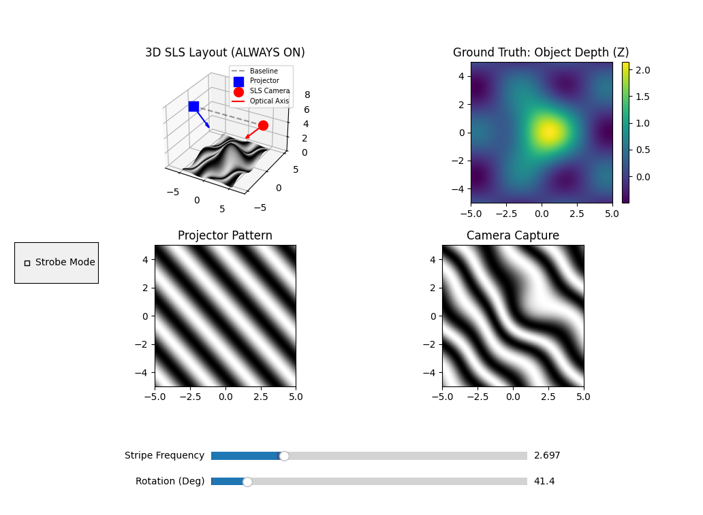

# Structured Light Scanner


> A visual and interactive simulator for a **Structured Light Scanner (SLS)** sensor. This project demonstrates how a **projector-camera system** uses projected stripe patterns to observe surface deformation and estimate 3D structure.

---

## Preview

[Structured Light Scanner Preview](./assets/images/SLS/SLS_Preview.png)



---

## Demo GIF

[Structured Light Scanner Demo](./assets/gifs/SLS/Preview_SLS.gif)


---

## Topics

- structured light scanner architecture
- projector-camera baseline geometry
- sinusoidal stripe projection
- stripe frequency control
- stripe rotation and orientation
- surface-induced pattern deformation
- simulated camera capture
- ground-truth depth visualization
- strobe / blinking illumination mode
- animated live scanning

---

## Main Script

- `src/structured_light_scanner_sensor.py`

---

## Features

- interactive 3D visualization of the scanned object
- synthetic surface generation for testing
- projected sinusoidal stripe pattern visualization
- simulated camera capture of deformed stripes
- projector and camera hardware placement in 3D
- baseline and optical axis visualization
- adjustable stripe frequency slider
- adjustable stripe rotation slider
- strobe mode toggle for blinking illumination
- animated scene updates using Matplotlib

---

## Simulation Layout

The simulator contains four coordinated views:

- **3D SLS Layout**  
  Displays the object surface, projected pattern, projector location, camera location, baseline, and optical axis.

- **Ground Truth: Object Depth (Z)**  
  Shows the true surface height/depth map used in the simulation.

- **Projector Pattern**  
  Displays the ideal stripe pattern emitted by the projector.

- **Camera Capture**  
  Displays the stripe pattern after deformation by the object surface.

---

## Controls

- **Stripe Frequency**  
  Adjusts the density of the projected sinusoidal stripes.

- **Rotation (Deg)**  
  Rotates the stripe pattern orientation from `0` to `360` degrees.

- **Strobe Mode**  
  Enables a blinking projector mode to simulate pulsed illumination.

---

## How It Works

The simulator creates a synthetic 3D object surface using a smooth Gaussian-like shape combined with sinusoidal variation. A virtual projector emits a sinusoidal stripe pattern across the object. The object's surface depth causes spatial deformation in the projected pattern, and a virtual camera observes the result.

This models the basic principle of structured light scanning:

1. project a known light pattern onto a surface
2. observe how the pattern is distorted
3. relate the deformation to object geometry
4. use the information for depth estimation and reconstruction

---

## Run

```bash
python src/structured_light_scanner_sensor.py
```

---

## Requirements

Install the required Python packages from [requirements.txt](../requirements.txt) file


## License

[MIT License](../LICENSE)

<!--

---

## Author
Karam Mawas
Technical University of Braunschweig / Institute of Geodesy and Photogrammetry and  (IGP)

Developed as a structured light scanning simulation and visualization tool for exploring projector-camera sensing concepts.

-->
