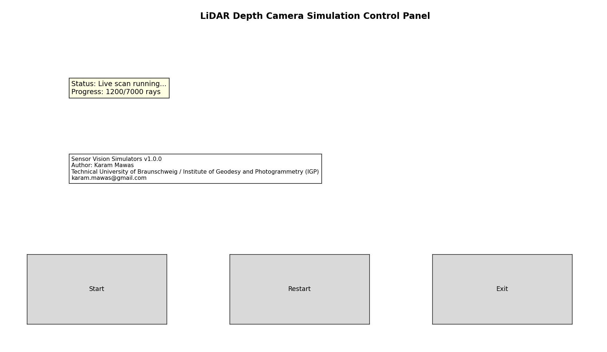
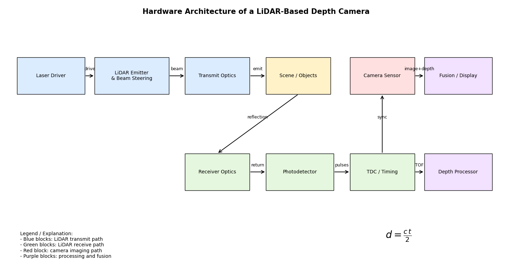
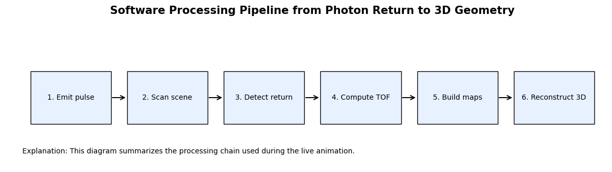
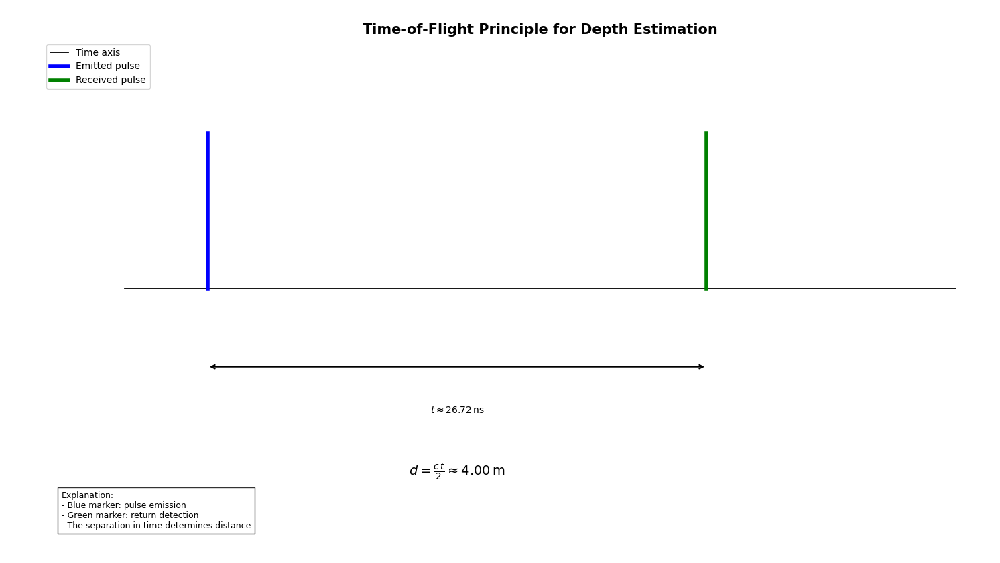

> A live LiDAR-based depth camera simulator for illustrating hardware architecture, time-of-flight ranging, progressive scanning, image reconstruction, and 3D point cloud formation.

---

## Overview

This simulator demonstrates how a **LiDAR-based depth camera** measures distance by emitting laser pulses, receiving reflected signals, and computing depth from **time-of-flight**.

It is designed for teaching and demonstration, so the user can observe both:

- the **hardware view** of the sensing system
- the **software/computational view** of how depth and 3D structure are reconstructed

---

## Live simulation controls

The simulator includes buttons for:

- **Start**
- **Restart**
- **Exit**

The live mode keeps the windows open and updates them progressively so students can see:

- rays being emitted
- hit points forming on surfaces
- the point cloud building up
- depth / TOF / intensity images being reconstructed frame by frame

This makes the simulator much more realistic and useful in class demonstrations.

---

## Hardware concept

A LiDAR-based depth camera includes several components working together:

- laser pulse source
- emitter / beam steering
- transmit optics
- receiver optics
- photodetector
- timing electronics
- depth reconstruction processing
- camera module for visual context

The simulator includes a dedicated figure that explains this sensing chain.

---

## Software Pipeline

Software processing pipleline from photon return to 3D geometry:

- Emit pulse
- Scan scene
- Detect return
- Compute ToF
- Build maps
- Reconstruct 3D

---

## Time-of-flight principle

The depth is estimated from the measured round-trip travel time of light:

The distance is computed as `d = (c . t) / 2`.

where:

- \(d\) is distance
- \(t\) is the measured return time
- \(c\) is the speed of light

The factor of \(2\) appears because the light travels to the object and back.

The simulator includes a visual explanation of this timing principle so students can connect the physics to the computed depth.

---

## 3D sensor rig and live ray scanning

The simulator shows a 3D scene where:

- the **camera** and **LiDAR** are represented as separate hardware units
- objects are placed on a ground plane
- rays are emitted from the LiDAR into the scene
- ray intersections accumulate on object surfaces

This allows students to watch how the scan progresses spatially.

---

## Progressive image reconstruction

As the LiDAR scans the environment, the simulator reconstructs multiple image-space outputs in real time:

- **Depth map**
- **Measured time-of-flight map**
- **Return intensity / reflectivity map**

This makes it easy to understand how physical measurements become image-like sensing outputs.

---

## Why the depth map and TOF map have different numerical values

A common question is why the **depth map** and the **time-of-flight map** do not show the same numbers.

They are related, but they are expressed in different units:

- depth is measured in **meters**
- time-of-flight is measured in **seconds** or **nanoseconds**

For example:

- 4 m corresponds to approximately 26.7 ns
- 14 m corresponds to approximately 93.4 ns

So if the depth map ranges from about \(4\) to \(14\) and the TOF map ranges from about \(25\) to \(100\), that is physically correct.

---

## Point cloud formation

Each successful LiDAR return produces a 3D point.

As more rays hit the scene, the point cloud becomes denser and the geometry of the objects becomes visible. This makes the relationship between:

- ray measurements
- depth image formation
- 3D geometric reconstruction

much easier to understand.

---

## Main file

This module currently contains one main simulator file:

[`lidar_depth_camera_live_sim.py`](Depth_camera/src/lidar_depth_camera_live_sim.py)
